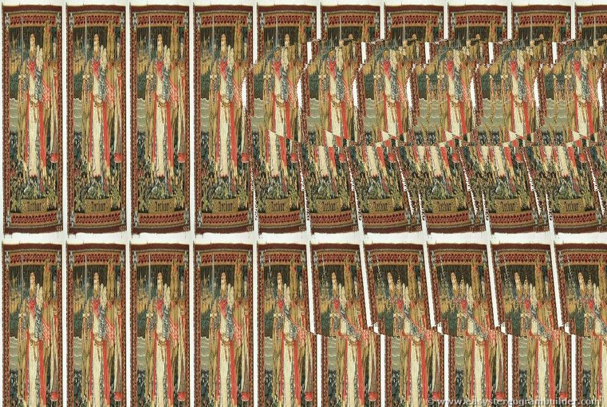

# Cicada-3301
In Attempt to solve Cicada 3301 Puzzle by myself 

## Start From Start.jpg


### Content Hidden in the image can be seen by opening image in any editor or in notepad.
> CLAVDIVS CAESAR says "lxxt>33m2mqkyv2gsq3q=w]O2ntk"

This is encrypted by CAESAR CIPHER   (Key 4 as Claudius was the 4th emperor).

So decrypt it by running ` clavdivs_caesar.py ` 
```python
for i in "lxxt>33m2mqkyv2gsq3q=w]O2ntk": print(chr(ord(i)-4),end="")
```
### You will get
> http://i.imgur.com/m9sYK.jpg


This image is decoy. You have to use outguess on `Start.jpg`

``` outguess -r Start.jpg Start.txt ```

### Now you get ` Start.txt `
>In which you have
http://www.reddit.com/r/a2e7j6ic78h0j/
and Book codes

#### There You find only 2 posts having images
* Problems: http://i.imgur.com/8D7hN.jpg

##### Outguess it You will get ` Problems.txt `
``` outguess -r Problems.jpg Problems.txt ```

* Welcome: http://i.imgur.com/KXLOP.jpg

##### Outguess it You will get ` Welcome.txt `
``` outguess -r Welcome.jpg Welcome.txt ```
